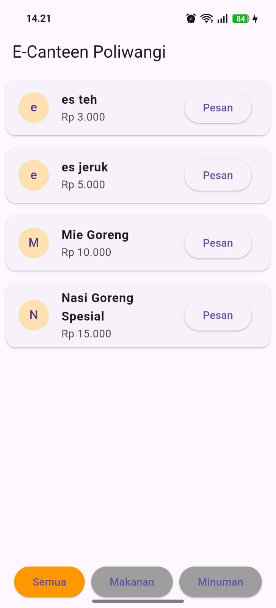
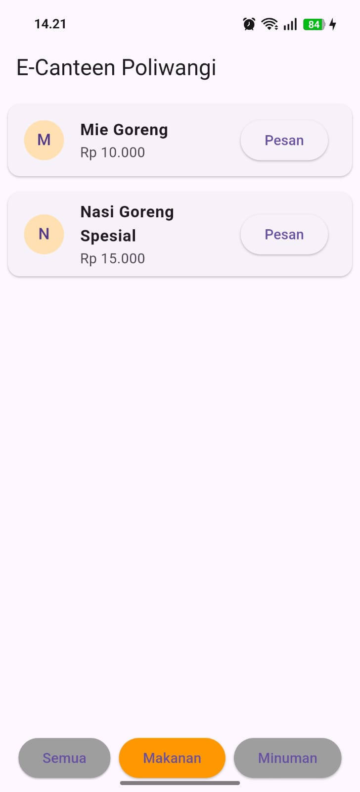
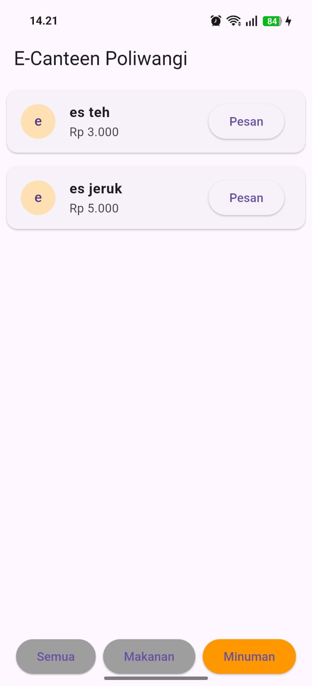
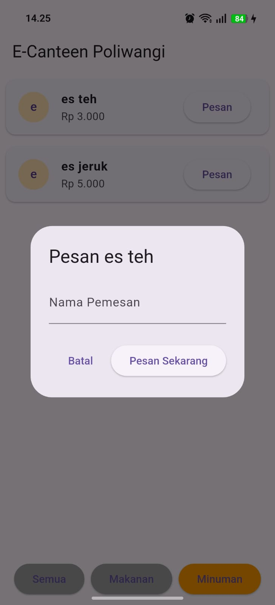
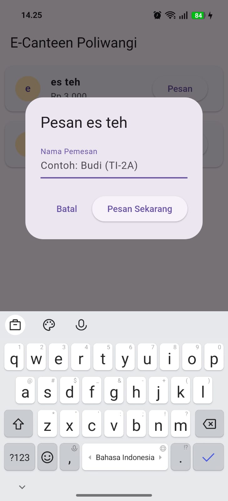
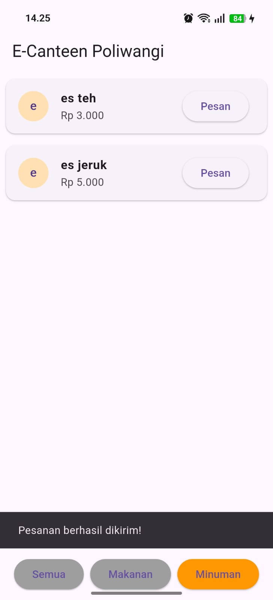

### Nama  : Nadhifah Afiyah Qurota'ain
### NIM   : 362458302100
### Kelas : 2D TRPL

# LAPORAN PEMBUATAN APLIKASI E-CANTEEN POLIWANGI

## PENDAHULUAN
   Aplikasi E-Canteen Poliwangi dibuat untuk mempermudahkan proses pemesanan makanan dan minuman di kantin kampus Politeknik Negeri Banyuwangi. Mahasiswa dapat melihat daftar menu yang tersedia, melakukan filter berdasarkan kategori, serta melakukan pemesanan secara langsung melalui aplikasi.

## TUJUAN
    Tujuan dan pembuatan aplikasi ini adalah
1. mengimplementasikan koneksi flutter dengan firebase.
2. Membuat sistem daftar menu.
3. Menenerapkan filter kategori makanan/minuman.
4. mengimplementasikan fitur pemesanan.

## LANGKAH - LANGKAH DAN HASIL PRAKTIKUM
Langkah - langkah praktikum:
1. Membuat Proyek baru dengan nama e-canteen
2. Membuka Firebase Console - add project - beri nama e-canteen-nim-nama
3. setelah itu masuk ke proyek, kemudian melakukan **"dart pub global activate fluuterfire_cli"**
4. kemudian menjalankan fluuterfire configure
5. setelah itu menambahkan firebase_core, cloud_firestore, intl di pubspec.yaml dengan menggunakan **"flutter pub add firebase_core cloud_firestore intl"**
6. kemudian melakukan flutter pub get
7. menginputkan syntax yang ada pada modul + menambahkan syntax 
    1) Di aplikasi, tambahkan 2 tombol (”Makanan” dan ”Minuman”).
    2) Gunakan.where(’category’, isEqualTo: ...)pada query StreamBuilder untuk memfilter list sesuai tombol yang ditekan.
8. membuat struktur database firestore
    1) membuat collection menus
        1. dengan field name (string), price (number), category (string), isAvailable (bool)

Hasil Praktikum:
1. tampilan awal yaitu semua menu
    
2. ketika menekan tombol makanan
    
3. ketika menekan tombol minuman
    
4. ketika menekan tombol pesan
    
5. ketika mau menginputkan nama
    
6. ketika pesanan di pesan
    

